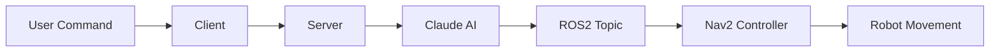

# ENPM605-Python-Applications-for-Robotics

# Source Code for ENPM605 (Spring 2025)

## Lecture 2 - Python Basics - Part I

### Learning Objectives

At the end of this lecture, you will learn the following:

- **Understand the Difference Between a Package and a Module**  
  - Define and differentiate between modules and packages in Python.  
  - Understand their use cases and organizational structure.  

- **Explore Different Ways to Import Modules**  
  - Use `import` statements to load built-in and custom modules.  
  - Use `from module import` syntax for selective imports.  
  - Understand aliasing and wildcard imports.  

- **Differentiate Between Mutable and Immutable Types**  
  - Identify mutable types such as lists, dictionaries, and sets.  
  - Identify immutable types such as integers, strings, and tuples.  

- **Understand Variables and Memory References**  
  - Learn how Python variables store references to objects in memory.  
  - Explore how reassignment affects references and object mutability.  

- **Work with the Boolean Type and Operators**  
  - Use boolean values (`True`, `False`) in logical expressions.  
  - Understand logical operators (`and`, `or`, `not`).  

- **Manipulate Strings and Perform String Operations**  
  - Create and manipulate string objects.  
  - Use string slicing, indexing, and formatting methods.  
  - Apply common string operations such as concatenation.  

- **Understand Numeric Types (`int` and `float`)**  
  - Differentiate between integers and floating-point numbers.  
  - Perform arithmetic operations on numeric data.  
  - Work with type conversions between numeric types.  

---

## Lecture 3 - Python Basics - Part II

### Learning Objectives

At the end of this lecture, you will learn the following:

- **Understand and Explain Iterables in Python**  
  - Define and identify iterable objects in Python.   

- **Distinguish Between In-Place and Out-of-Place Operations**  
  - Explain the differences between modifying data in place vs. returning new objects.  
  - Understand the implications of each approach on memory and performance.  

- **Master List Operations**  
  - Create and modify lists.  
  - Access elements using indexing and slicing.  
  - Use list comprehensions for efficient operations.  

- **Work Effectively with Tuples**  
  - Understand tuple immutability and its advantages.  
  - Perform operations such as packing, unpacking, and indexing.  

- **Implement Dictionaries for Key-Value Storage**  
  - Create, access, and modify dictionary entries.  
  - Iterate over dictionary keys, values, and items efficiently.  

- **Use Sets for Unique Collection Management**  
  - Perform set operations such as union and intersection.  
  - Understand the advantages of using sets over lists for uniqueness constraints.  

---

## Lecture 4 - Functions - Part I

### Learning Objectives

At the end of this lecture, you will learn the following:

- **Understand Function Basics**  
  - Define and call functions in Python.  
  - Differentiate between function definitions and function calls.  

- **Use Function Arguments Effectively**  
  - Work with positional and keyword arguments.  
  - Apply default arguments correctly.  
  - Use variable-length arguments with `*args` and `**kwargs`.  

- **Implement Modular Programming Principles**  
  - Organize code into reusable functions.  
  - Import and use functions from different modules.  

- **Comprehend Function Execution Flow**  
  - Follow function execution steps, including name resolution and scope handling.  
  - Apply the **LEGB rule** to resolve variable scope.  

- **Work with Mutable and Immutable Objects in Functions**  
  - Understand Python’s **pass-by-assignment** behavior.  
  - Prevent unintended modifications to mutable objects inside functions.  

- **Apply Argument Packing and Unpacking**  
  - Use `*args` and `**kwargs` for flexible function definitions.  
  - Unpack iterables and dictionaries in function calls.  

- **Enhance Code Readability with Type Hints**  
  - Implement type hints to clarify function inputs and outputs.  
  - Use Python’s `typing` module for specifying generic and optional types.  

- **Manage Nested Functions**  
  - Define and use functions inside other functions.  
  - Modify enclosing variables using the `nonlocal` keyword.  

- **Understand Python's Scopes**  
  - Apply the **LEGB rule** for variable resolution.  
  - Modify global variables using the `global` keyword.  


---

## Lecture 5 - Functions - Part II

### Learning Objectives

At the end of this lecture, you will learn the following:

- Understand different programming paradigms (Imperative, Procedural, Object-Oriented, and Functional).
- Focus on Functional Programming:
  - Pure functions.
  - Lambda expressions.
  - First class functions.
  - Higher-order functions.
  - Function compositions.
  - Recursive functions.

## Lecture 6 - OOP - Part I

### Learning Objectives

At the end of this lecture, you will learn the following:

- Understand closures.
- Understand decorators.
- Object-oriented programming:
  - Understand classes.
  - Understand objects.
  - Learn the differences between instance and class attributes.
  - Understand __init__, self, and magic methods.

## Lecture 7 - OOP - Part II

### Learning Objectives

At the end of this lecture, you will learn the following:

- Describe the Pythonic way to implement encapsulation.
- Identify and implement *class relationships* (association, aggregation, composition).
- Explain and apply *inheritance* in Python.
- Differentiate between *generalization* and *specialization*.
- Implement *method overriding* and understand *polymorphism*.
- Use *abstract base classes (ABCs)* to enforce method implementation.

-------------------------------------------------------------------------------------

# Source Code for ENPM605 (Spring 2025) ROS Files

ROS packages for ENPM605 (Spring 2025)

# Lecture 14

## System Monitor

- Source: [ros2_system_monitor](https://github.com/AgoraRobotics/ros2-system-monitor)
### Build and Run

```bash 
colcon build --symlink-install --packages-select ros2_system_monitor
source install/setup.bash
ros2 launch ros2_system_monitor system_monitor.launch.py
# Check the /diagnostics topic
ros2 topic echo /diagnostics
```

## ROSAnthropic Nav2


A ROS2 package that enables natural language robot navigation using Anthropic's Claude AI and the Navigation2 stack.
- Source: [rosgpt](https://github.com/aniskoubaa/rosgpt)
### Overview

ROSAnthropic Nav2 creates a bridge between natural language commands and robotic navigation. Users can control a ROS2-enabled robot using simple spoken or typed commands such as "Go to top_right_corner" or "Follow a path through the top left corner, top right corner, and bottom h."

The system leverages Anthropic's Claude AI to parse natural language commands and convert them into structured navigation instructions that the Navigation2 stack can execute.

### Environment Setup

```bash 
# Set up Anthropic API key
export ANTHROPIC_API_KEY=your_anthropic_api_key
```
### Features

- Natural language command interpretation
- Multiple navigation modes:
  - Direct navigation to a single destination
  - Sequential waypoint navigation (with stops at each point)
  - Continuous path following (without stopping)
- Web interface for command input
- Text-to-speech feedback (optional)
- Robust error handling and graceful degradation


### Components

The system consists of three main Python scripts:

1. **ros_anthropic_nav2_server.py**: Provides a web server interface and connects to Claude AI
2. **ros_anthropic_nav2_control.py**: Controls robot navigation using the Nav2 stack
3. **ros_anthropic_nav2_client.py**: Command-line interface for sending navigation commands


#### Command Input (Client)
- User enters natural language commands
- Client sends commands to server via HTTP POST
- Example commands:
  - "Go to top right corner"
  - "Navigate through top right corner, bottom right corner, and bottom left corner"

#### Language Processing (Server)

- Server receives text command
- Command sent to Claude AI via Anthropic API
- Claude converts natural language to structured JSON format
- Supported action types:
  - `go_to_goal`: Single location navigation
  - `follow_path`: Continuous path through multiple points
  - `sequence`: Series of waypoints with optional stopping

#### Command Publishing

- Server publishes JSON command to `/voice_cmd` ROS2 topic
- Optional text-to-speech provides verbal feedback

#### Navigation Execution (Controller)

- Controller subscribes to `/voice_cmd` topic
- Parses JSON command to extract navigation parameters
- Maps location names to physical coordinates
- Uses Nav2's BasicNavigator for navigation execution

####  Movement Strategies

- Direct Navigation: Go to a single destination
- Waypoint Following: Visit multiple locations with stops
- Continuous Path: Follow a path without stopping at intermediary points

#### Example Command Flow

For the command: `"Go to top right corner, then to bottom left"`

1. **User Entry**: Types command in client interface
2. **Client Processing**: Sends HTTP request to server
3. **Server Processing**: Forwards to Claude AI
4. **AI Understanding**: Claude generates structured JSON:
```json
{
  "action": "sequence", 
  "params": [
    {"action": "go_to_goal", "params": {"location": {"type": "str", "value": "top_right_corner"}}},
    {"action": "go_to_goal", "params": {"location": {"type": "str", "value": "bottom_left_corner"}}}
  ],
  "continuous_path": false
}
```
5. **Command Publishing**: JSON published to ROS2 topic
6. **Navigation Planning**: Controller extracts waypoints
7. **Execution**: Nav2 navigates to kitchen, stops, then continues to bedroom
8. **Completion**: Controller logs successful navigation
9. 
### Available Locations

The system is configured with the following locations:
- top_right_corner
- top_left_corner
- bottom_left_corner
- bottom_right_corner
- top_h
- bottom_h

### Installation

Install required dependencies:

#### Python Dependencies

```bash
pip install anthropic flask flask-restful flask-cors rclpy requests pyttsx3 transforms3d
```

#### ROS2 Dependencies

```bash
# Install missing dependencies
rosdep install --from-paths src -y --ignore-src

```

#### Run Demonstration
```bash
# Build the packages
colcon build --symlink-install --packages-select mapping_navigation_demo rosgpt

# Start the simulation environment
ros2 launch mapping_navigation_demo navigation_with_map_corrected.launch.py

# Start the controller
ros2 run rosgpt anthropic_nav2_control

# Start the server
ros2 run rosgpt anthropic_nav2_server

# Start the client
ros2 run rosgpt anthropic_nav2_client

```

## Foxglove Studio

- Source: [Foxglove Studio](https://foxglove.dev/)
